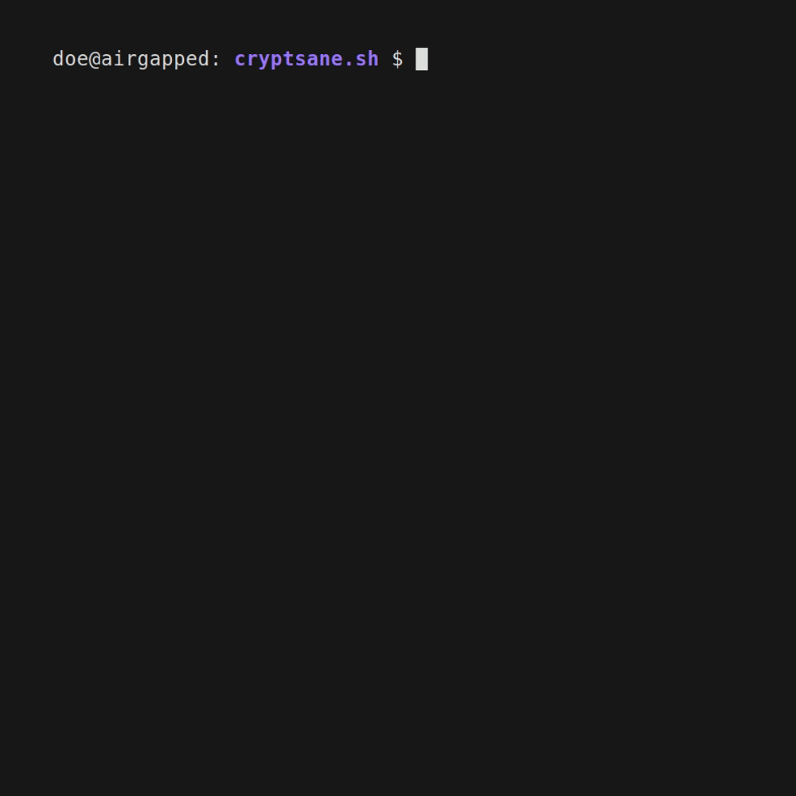
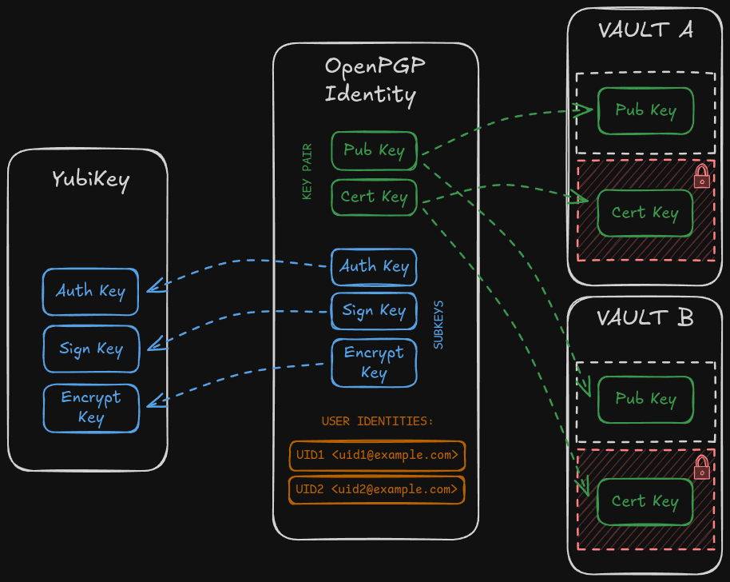

# cryptsane.sh

> [!WARNING]
> The sole reason why this script/tool was created was for me to refresh my
> rusty Bash knowledge. It is definitely not the right way how to implement
> a tool like this. Use this tool at your own risk!

A rather insane (in its implementation) Bash TUI tool that attempts to make 
working with GnuPG and YubiKey a bit more sane. The tool essentially implements
all suggestions from the [YubiKey-Guide](https://github.com/drduh/YubiKey-Guide)
and adds some additional functionality. 

## Table of Contents
- [Overview](#overview)
- [Requirements](#requirements)
- [How to run](#how-to-run)
- [Configuration](#configuration)
- [Run Modes](#run-modes)
- [Credits](#credits)

## Overview
Core usage example:
1. Mount a [Vault](#vault).
2. Generate an [OpenPGP Identity](#openpgp-identity).
3. Export the OpenPGP Identity to the Vault.
4. Move the subkeys to a YubiKey.
5. Exit.





#### Vault
A block device with two partitions: `vault-secret` and `vault-public`.
The `vault-secret` partition is LUKS-encrypted and intended for storing private keys
(the certification key and, optionally, the subkeys). The `vault-public`
partition is used for storing public keys.

#### OpenPGP Identity
Each `OpenPGP Identity` represents at least one `User Identity` 
(one primary UID and, optionally, `N` additional UIDs) and exactly five keys: a key pair
(a `public` key and a secret `certification` key) and
three `subkeys` (a `signature` key, an `authentication` key and an `encryption` key). 
The `subkeys` are then used for the day-to-day cryptographic operations.
The`Certification` key is only used to issue the `sub-keys` and should
never come in contact with an online system. `Public` key holds all public information
about the `OpenPGP Identity` (e.g, UIDs, fingerprints...)

#### User Identity
Typically in the form of `Name <email>` (e.g., `John Doe <doe@example.com>`).


## Requirements

Software:
- `Bash 4+` 
- `Gum 0.15+`
- `GnuPG 2.4+`
- `yubikey-manager 5.1+`
- `pcsclite`
- `cryptsetup`
- `ccid`
- `less`

Hardware:
- YubiKey 5
- USB stick(s) (100MB used for the secret partition, rest for the public partition)

## How to run

### Arch Linux
1. Install necessary packages.
```bash
pacman -S gum gnupg yubikey-manager ccid pcsclite cryptsetup less
```

2. Start and enable `pcscd`.
```bash
systemctl start pcscd
systemctl enable pcscd
```

3. Disable the integrated CCID driver in GnuPG's `scdaemon` (smart card daemon).
   Instead, we will use access through the `pcscd` daemon.

```bash
echo "disable-ccid" >> ~/.gnupg/scdaemon.conf
gpgconf --kill gpg-agent
```

4. Make sure YubiKey is accessible via `yubikey-manager` and also via `gpg`.

```console
$ ykman info
Device type: YubiKey 5 NFC
Serial number: 12345678
Firmware version: 4.3.2
Form factor: Keychain (USB-A)
Enabled USB interfaces: OTP, FIDO, CCID
NFC transport is enabled

Applications	USB          	NFC
Yubico OTP  	Enabled      	Enabled
FIDO U2F    	Enabled      	Enabled
FIDO2       	Enabled      	Enabled
OATH        	Enabled      	Enabled
PIV         	Enabled      	Enabled
OpenPGP     	Enabled      	Enabled
YubiHSM Auth	Not available	Not available
```

```console
$ gpg --card-status
Reader ...........: Yubico YubiKey 5 NFC 0
Application ID ...: D2760001240103030006112233445500
Version ..........: 3.4
Manufacturer .....: Yubico
Serial number ....: 12345678
Name of cardholder: [not set]
Language prefs ...: [not set]
Salutation .......:
URL of public key : [not set]
Login data .......: [not set]
Signature PIN ....: not forced
Key attributes ...: rsa4096 rsa4096 rsa4096
Max. PIN lengths .: 127 127 127
PIN retry counter : 3 3 3
Signature counter : 42
KDF setting ......: off
UIF setting ......: off
Signature key ....: 0123 4567 89AB CDEF 0123 4567 89AB CDEF 0123 4567
      created ....: 2023-01-01 12:00:00
Encryption key....: 2345 6789 ABCD EFFF 2345 6789 ABCD EFFF 2345 6789
      created ....: 2023-01-01 12:00:00
Authentication key: 3456 789A BCDE F012 3456 789A BCDE F012 3456 789A
      created ....: 2023-01-01 12:00:00
General key info..: [none]
```

5. Clone the repository and run the script
```console
$ ./cryptsane -h
Usage: cryptsane [OPTIONS]

Description:
  Cryptsane is a TUI tool for managing OpenPGP/GnuPG/YubiKey madness. 
  The tools allows you to:
  - Create an OpenPGP Identity (key pair + subkeys + UIDs).
  - Create a Vault (a USB block device with one LUKS-encrypted and one unencrypted
    partition)
  - Export an OpenPGP Identity to a Vault.
  - Import an OpenPGP Identity from a Vault
  - Move subkeys to a YubiKey.
  - Rotate subkeys (revoke existing and generate new ones)
  - Some other usefull stuff

Options:
  -h, --help       Show this help message and exit.
  -p, --private    Run in private mode (root privileges required).

Examples:
  cryptsane
  cryptsane -p
```

### Docker (WIP/poorly tested)
It is also possible to run the tool as a Docker container. However, accessing
USB sticks (vault devices) can be somewhat clunky—the device must be plugged
in before the containerized TUI is launched, otherwise the tool will not be
able to detect it. You should also expect some issues with permissions, especially
when running it in user mode.

1. Build the docker image.
```Console
$ ./build-cryptsane-docker 
```

2. Run the tool.
```Console
$ ./cryptsane-docker -h
Usage: cryptsane-docker [OPTIONS]

Description:
  Cryptsane is a TUI tool for managing OpenPGP/GnuPG/YubiKey madness. 
  The tools allows you to:
  - Create an OpenPGP Identity (key pair + subkeys + UIDs).
  - Create a "Vault" (a USB block device with one LUKS-encrypted and one unencrypted
    partition)
  - Export an OpenPGP Identity to a Vault.
  - Import an OpenPGP Identity from a Vault
  - Move subkeys to a YubiKey.
  - Rotate subkeys (revoke existing and generate new ones)
  - Some other usefull stuff

Options:
  -h, --help       Show this help message and exit.
  -p, --private    Run in private mode (root privileges required).

Examples:
  cryptsane-docker
  cryptsane-docker -p
```

## Configuration

All default configuration values are taken from the
[Yubikey-Guide](https://github.com/drduh/YubiKey-Guide). Refer to the guide for
explanations.

| env variable                  | default value | description | 
|:------------------------------|:--------------|:------------|
| `CRYPTSANE_KEY_TYPE`          | rsa4096       |[Key](https://github.com/drduh/YubiKey-Guide?tab=readme-ov-file#key) |
| `CRYPTSANE_SUBKEY_EXPIRATION` | 2y            |[Expiration](https://github.com/drduh/YubiKey-Guide?tab=readme-ov-file#expiration) |
| `CRYPTSANE_VAULT_FS`          | ext2          |[Vault FS](https://github.com/drduh/YubiKey-Guide?tab=readme-ov-file#expiration). Only `ext2` was tested with this tool. |


## Run Modes

The tool can be run in two modes: `private` and `user`. `Private` mode is
intended for use on a single-user offline (ideally air-gapped) device, while
`user` mode is intended to be run on your regular online workstation.

### Private mode
```
sudo ./cryptsane --private
```
Allows you to:
 - Create a new vault.
 - Create, edit, import, or export an OpenPGP Identity.
 - Revoke and generate new subkeys for an OpenPGP Identity.
 - Move subkeys to a YubiKey.

### User mode
```bash
./cryptsane
```
Allows you to:
 - Import an OpenPGP Identity's public key from the `vault-public` partition to your
   `GNUPGHOME`.
 - Select an existing OpenPGP Identity from your `GNUPGHOME`.
 - Use the OpenPGP Identity, combined with subkeys stored on a YubiKey, for
   cryptographic operations.

## Credits

- [Yubikey-Guide](https://github.com/drduh/YubiKey-Guide): a brilliant guide that
  helped me make some sense of the PGP/GnuPG/YubiKey insanity.
- [Gum](https://): an awesome tool for making CLI/TUI bash tools.
